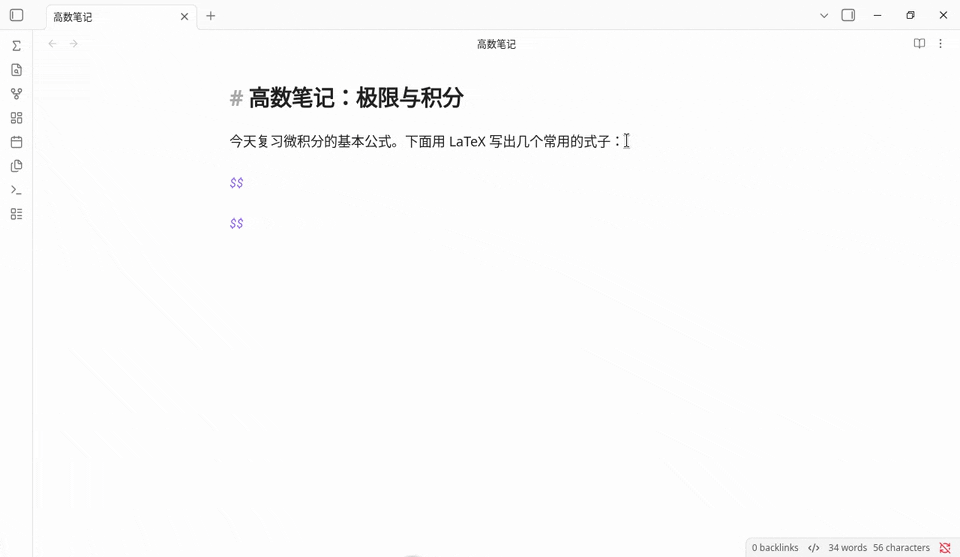
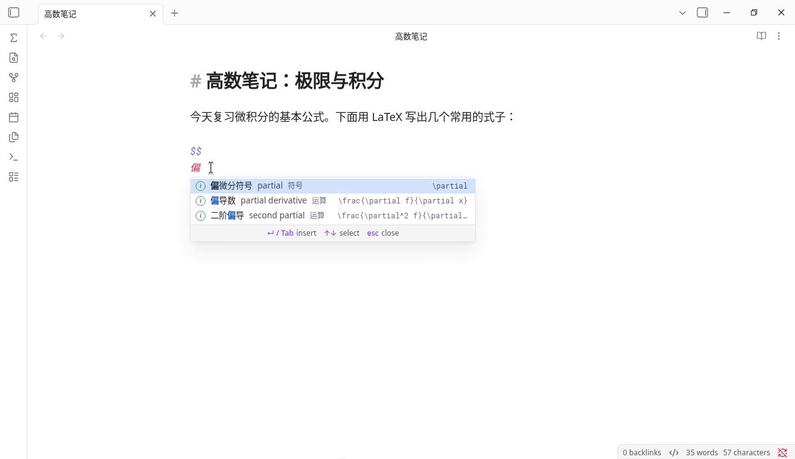
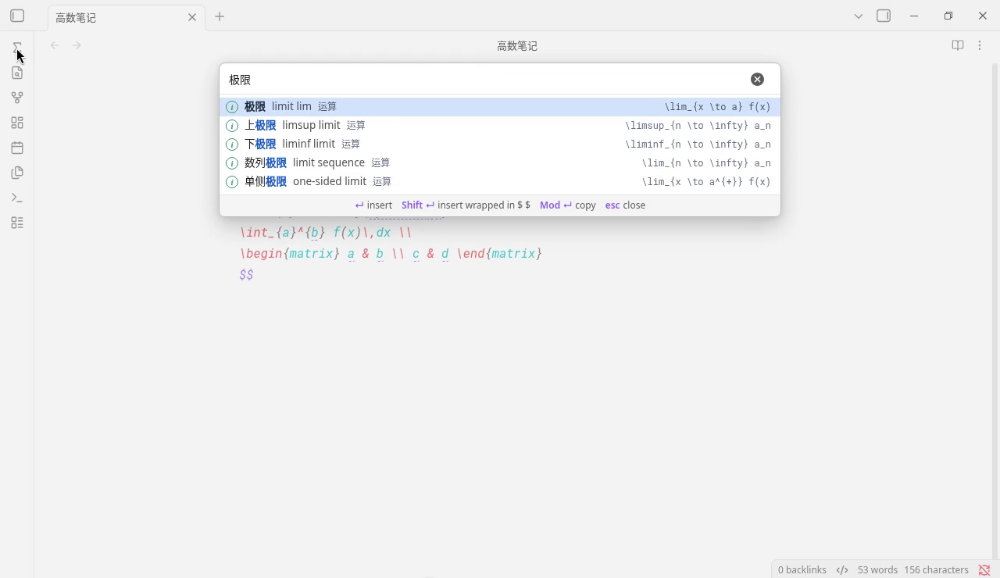

# LaTeX Autofill

IDE-style LaTeX autocomplete for [Obsidian](https://obsidian.md). Type inside a math block and a completion list pops up at the cursor, the way code completion works in an IDE. Every command can be found by its English name, its Chinese name, or the LaTeX command itself.

[中文说明](#中文说明)



## Why another LaTeX completer?

Most LaTeX completers match what you type against command names, so you have to know `\overset` or `\left.` before they can help. LaTeX Autofill matches what you mean, in Chinese or English, and inserts a complete formula with placeholders you can `Tab` through. It works as soon as it's enabled, runs fully offline, and uses no AI. The full Completr command list is included for when you do know the name.

Other Obsidian plugins cover parts of this, and each has its own strengths:

| | LaTeX Autofill | [Easy LaTeX](https://github.com/wmwby/obsidian-easy-latex) | [LaTeX Complete](https://github.com/Yetchill/obsidian-latex-complete) | [Completr](https://github.com/tth05/obsidian-completr) |
|---|---|---|---|---|
| How matches are found | By meaning: names, synonyms and keywords in Chinese and English, plus command names | Command prefix or description; Chinese, Japanese and Korean keywords map to commands | Command-name prefix (case-sensitive) | Command name |
| Find `\frac{\partial f}{\partial x}` by typing | `偏导数` or `partial derivative` | Keywords map to single commands such as `\partial` | `\par` | `\frac` or `\partial` |
| Chinese keywords without typing `\` | Yes | Yes (also Japanese and Korean) | No; Chinese is shown as a description | No |
| What gets inserted | Full templates with example contents; `Tab` / `Shift+Tab` walk every argument and every matrix cell | Commands with tab stops; custom snippets with `$1`, `$2` | The command name only | Commands with `#` placeholders |
| Setup | None | None for completion; custom mappings and AI in settings | None; key bindings configurable | None; LaTeX is one of several providers |
| Offline, no AI | Yes | Completion is offline; optional AI formula generation through an OpenAI-compatible API | Yes | Yes |
| Also completes ordinary words, front matter, callouts | No, LaTeX only | No | No | Yes |

The comparison is based on each project's README as of September 2026. If something here is out of date, please open an issue.



## Features

- **Autocomplete while typing.** Type `\` followed by a command or a keyword (`\frac`, `\sum`, `\integral`) anywhere. Inside `$...$` or `$$...$$` you can skip the backslash: three or more letters (`alpha`, `matrix`) or any Chinese word (`求和`) is enough. Without the backslash only curated entries are shown, so ordinary words in a formula don't flood the list. Inside `\text{…}`, `\mbox{…}`, `\operatorname{…}` and similar text-mode commands, the list only opens after a backslash, so you can write prose there.
- **English and Chinese search.** 236 curated entries covering operators, relations, sets, logic, arrows, brackets, fonts, accents, functions, matrices, environments, spacing, probability, and the Greek alphabet, ranked above the plain command list. Each entry has a short English name (`Summation`, `Definite integral`, `Proportional to`), so English queries rank the same way Chinese ones do.
- **Placeholders.** After inserting, the first argument is selected. `Tab` jumps to the next one and `Shift+Tab` goes back; after the last one, `Tab` moves the cursor past the snippet. Remaining placeholders are underlined. In matrices and `cases`, every cell is a placeholder. Commands from the plain list insert empty arguments, so nothing is left behind if you skip one.
- **Nested snippets.** Completing inside a placeholder (for example `\sqrt` inside `\frac{…}`) keeps the outer snippet's remaining placeholders.
- **Inline-aware.** Multi-line environments are flattened to one line inside `$...$`.
- **Auto-wrap outside math.** Triggering with `\` in normal text inserts `$...$` for you. Code blocks (```` ``` ```` and `~~~`) and inline code are left alone.
- **Search window.** Open "Search LaTeX" from the command palette or the Σ ribbon icon to browse everything. `Enter` inserts, `Shift+Enter` inserts wrapped in `$ $`, `Cmd/Ctrl+Enter` copies.
- **Interface language.** Menus, hints, and formula names follow Obsidian's language: Chinese names when it is Chinese (with the English name beside them), and English names otherwise (with the Chinese name beside them). Search always accepts both.



| Key | Action |
|---|---|
| `↑` `↓` | Move selection in the list |
| `Enter` / `Tab` | Insert |
| `Tab` / `Shift+Tab` | Next / previous placeholder |
| `Esc` | Close the list, or stop placeholder jumping |

## Installation

### Beta through BRAT

1. Install and enable [BRAT](https://github.com/TfTHacker/obsidian42-brat) from **Settings → Community plugins**.
2. Run **BRAT: Add a beta plugin for testing** from the command palette.
3. Enter `yikhan519/latex-autofill` and choose the latest version.
4. Enable **LaTeX Autofill** in **Settings → Community plugins**. BRAT keeps it updated.

### Manual

1. Download `main.js`, `manifest.json`, and `styles.css` from the [latest release](../../releases/latest).
2. Create the folder `<your vault>/.obsidian/plugins/latex-autofill/` and put the three files in it.
3. In Obsidian, open **Settings → Community plugins**, then enable **LaTeX Autofill**.

Requires Obsidian 1.7.2 or later.

## Notes

- Inside a `$$` block, a plain English word can open the list. Press `Esc` first if you want `Enter` to start a new line.
- If you also use LaTeX Suite, both plugins listen for `Tab` in math. While the list is open or placeholders are active, this plugin takes it.
- Don't enable Completr's LaTeX provider at the same time, or two lists will pop up.

## Adding entries

Curated entries live in the `DATA` block at the top of `main.js`, one per line:

```
category ;; Chinese name ;; keywords (English and Chinese) ;; LaTeX ;; English name
```

The English name is optional. Leave it off and it is taken from the first English keywords. Each `{...}` argument and each matrix cell becomes a placeholder automatically. Pull requests with new entries are welcome.

## Credits

The plain command list comes from [Completr](https://github.com/tth05/obsidian-completr) by tth05, used under the MIT License. See [THIRD_PARTY_LICENSES](THIRD_PARTY_LICENSES).

---

## 中文说明

在 Obsidian 公式里打字时，像 IDE 一样在光标处弹出 LaTeX 补全。中文名、英文名或命令本身都能搜到。


### 和其他插件有什么不同

大多数 LaTeX 补全插件只按命令名匹配，得先知道命令叫什么才能用。这个插件按意思匹配，中英文都行：想要偏导数，直接打「偏导数」，插入的是完整写法，`Tab` 在各个参数间跳。启用即可用，不用任何设置，完全离线，不用 AI。同时也收录了 Completr 的完整命令表，知道命令名时照样能用。

Obsidian 里还有几个插件也能做其中一部分，各有长处：

| | LaTeX Autofill | [Easy LaTeX](https://github.com/wmwby/obsidian-easy-latex) | [LaTeX Complete](https://github.com/Yetchill/obsidian-latex-complete) | [Completr](https://github.com/tth05/obsidian-completr) |
|---|---|---|---|---|
| 怎么匹配 | 按意思：中英文名称、近义词、关键词，以及命令名 | 命令前缀或说明；中文、日文、韩文关键词对应到命令 | 命令名前缀（区分大小写） | 命令名 |
| 找到 `\frac{\partial f}{\partial x}` 要打 | `偏导数` 或 `partial derivative` | 关键词对应单个命令，比如 `\partial` | `\par` | `\frac` 或 `\partial` |
| 不打 `\` 直接输中文 | 支持 | 支持（还支持日文、韩文） | 不支持，中文只作为说明显示 | 不支持 |
| 插入什么 | 带示例内容的完整写法，`Tab` / `Shift+Tab` 逐个参数、逐格跳 | 带跳转位置的命令；可自定义带 `$1`、`$2` 的片段 | 只插入命令名 | 带 `#` 占位符的命令 |
| 需要设置吗 | 不需要 | 补全不需要；自定义映射和 AI 在设置里 | 不需要，可以改快捷键 | 不需要；LaTeX 是它的补全来源之一 |
| 离线、不用 AI | 是 | 补全离线；可选通过 OpenAI 兼容接口用 AI 生成公式 | 是 | 是 |
| 也补全普通单词、front matter、callout | 不，只做 LaTeX | 不 | 不 | 是 |

以上对比依据各项目 2026 年 9 月的 README。如有过时的地方，欢迎提 issue。


### 怎么用

- 任何地方打 `\` 加命令或关键词，例如 `\frac`、`\sum`、`\求和`。
- 在 `$...$` 或 `$$...$$` 里可以不打 `\`：连续 3 个以上英文字母，或者任意中文，都会弹出候选。不打 `\` 时只显示精选条目，免得公式里的普通单词弹出一大堆。
- 在 `\text{…}`、`\mbox{…}`、`\operatorname{…}` 等文字命令里，只有打 `\` 才会弹出候选，可以放心写中文或英文句子。
- `↑` `↓` 选择，`回车` 或 `Tab` 插入，`esc` 关闭。
- 插入后自动选中第一个参数；`Tab` 跳到下一个，`Shift+Tab` 回到上一个，最后一个之后再按 `Tab`，光标跳到这段写法的末尾。没填的参数有下划线提示。矩阵和分段函数的每一格都是参数。普通命令表里的命令插入的是空参数，跳过不填也不会留下多余字符。
- 在参数里再补全（比如在 `\frac{…}` 里补一个 `\sqrt`），外层剩下的参数照样能跳。
- 在 `$...$` 里插入多行环境，会自动合并成一行。
- 在公式外面用 `\` 触发，会自动包上 `$ $`。代码块（```` ``` ```` 和 `~~~`）和行内代码里不会触发。
- 按 `Cmd+P` 搜索「搜索 LaTeX 写法」，或点左侧 Σ 图标，可以打开完整的搜索窗口。
- Obsidian 语言设为中文时，界面和公式名显示中文，英文名附在旁边；否则公式名显示英文，中文名附在旁边。搜索始终中英文都支持。


### 安装

**通过 BRAT 安装测试版**

1. 在「设置 → 第三方插件」里安装并启用 [BRAT](https://github.com/TfTHacker/obsidian42-brat)。
2. 在命令面板里运行 **BRAT: Add a beta plugin for testing**。
3. 输入 `yikhan519/latex-autofill`，选择最新版本。
4. 在「设置 → 第三方插件」里启用 **LaTeX Autofill**。之后 BRAT 会自动更新。

**手动安装**

从 [最新 Release](../../releases/latest) 下载 `main.js`、`manifest.json`、`styles.css`，放进 `<你的 Vault>/.obsidian/plugins/latex-autofill/`，再到「设置 → 第三方插件」里启用 **LaTeX Autofill**。

需要 Obsidian 1.7.2 或更高版本。

### 致谢

普通命令表来自 tth05 的 [Completr](https://github.com/tth05/obsidian-completr)，按 MIT 协议使用，详见 [THIRD_PARTY_LICENSES](THIRD_PARTY_LICENSES)。

## License

[MIT](LICENSE)
