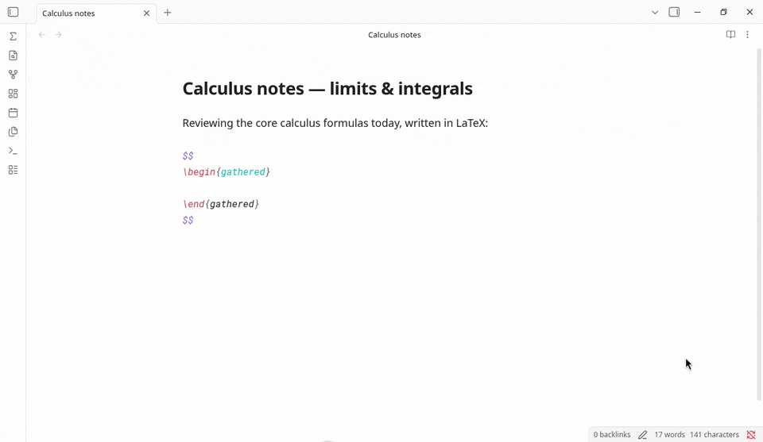
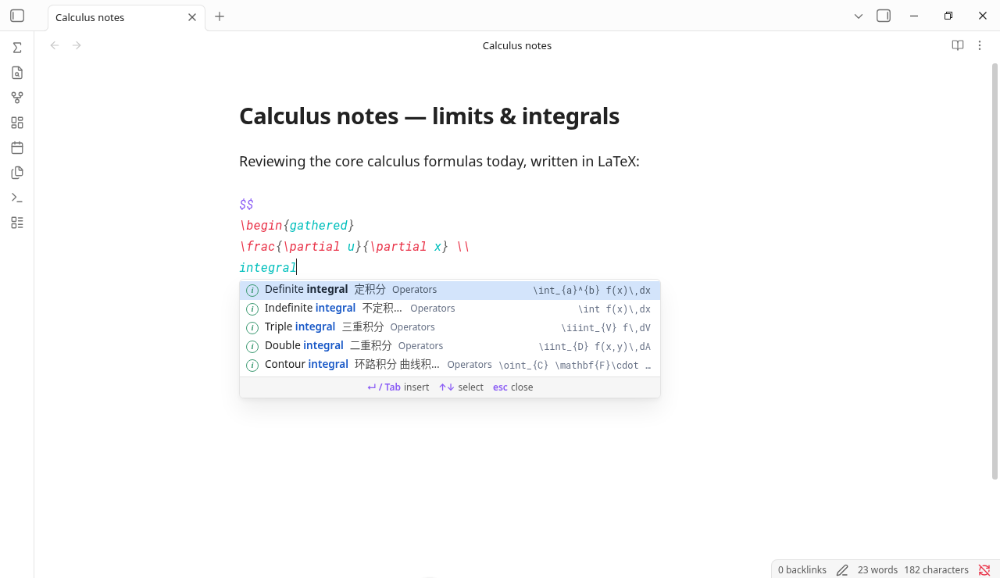
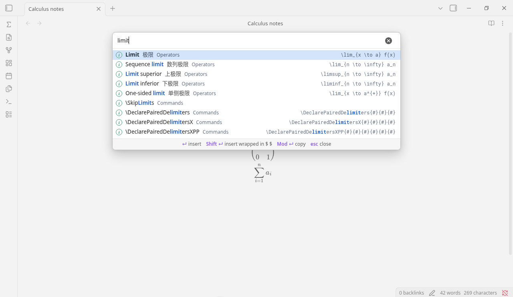

[](https://xinquji.com)

# LaTeX Autofill

[](https://community.obsidian.md/plugins/latex-autofill)
[](https://community.obsidian.md/plugins/latex-autofill)
[](https://github.com/yikhan519/latex-autofill/stargazers)
[](LICENSE)

IDE-style LaTeX autocomplete for [Obsidian](https://obsidian.md). Type inside a math block and a completion list pops up at the cursor, the way code completion works in an IDE. Every command can be found by its English name, its Chinese name, or the LaTeX command itself.

[中文说明](#中文说明)

## Installation

Requires Obsidian **1.7.2** or later.

### Community plugins

Install from the [official Obsidian Community Plugins directory](https://community.obsidian.md/plugins/latex-autofill):

1. In Obsidian, open **Settings → Community plugins → Browse**.
2. Search for **"LaTeX Autofill"**.
3. Choose **Install**, then **Enable**.

### Early builds via BRAT

1. Install and enable [BRAT](https://github.com/TfTHacker/obsidian42-brat) from **Settings → Community plugins**.
2. Run **BRAT: Add a beta plugin for testing** from the command palette.
3. Enter `yikhan519/latex-autofill` and choose the latest version.
4. Enable **LaTeX Autofill** in **Settings → Community plugins**. BRAT keeps it updated.

### Manual

1. Download `main.js`, `manifest.json`, and `styles.css` from the [latest release](../../releases/latest).
2. Create the folder `<your vault>/.obsidian/plugins/latex-autofill/` and put the three files in it.
3. In Obsidian, open **Settings → Community plugins**, then enable **LaTeX Autofill**.



## Why another LaTeX completer?

Most LaTeX completers match what you type against command names, so you have to know `\overset` or `\left.` before they can help. LaTeX Autofill matches what you mean, in Chinese or English, and inserts a complete formula with placeholders you can `Tab` through. It works as soon as it's enabled, runs fully offline, and uses no AI. The full Completr command list is included for when you do know the name.

Other Obsidian plugins cover parts of this, and each has its own strengths:

| | LaTeX Autofill | [Easy LaTeX](https://github.com/wmwby/obsidian-easy-latex) | [LaTeX Complete](https://github.com/Yetchill/obsidian-latex-complete) | [Completr](https://github.com/tth05/obsidian-completr) |
|---|---|---|---|---|
| How matches are found | By meaning: names, synonyms and keywords in Chinese and English, plus command names | Command prefix or description; Chinese, Japanese and Korean keywords map to commands | Command-name prefix (case-sensitive) | Command name |
| Find `\frac{\partial f}{\partial x}` by typing | `偏导数` or `partial derivative` | Keywords map to single commands such as `\partial` | `\par` | `\frac` or `\partial` |
| Chinese keywords without typing `\` | Yes | Yes (also Japanese and Korean) | No; Chinese is shown as a description | No |
| What gets inserted | Full templates with example contents; `Tab` / `Shift+Tab` walk every argument and every matrix cell | Commands with tab stops; custom snippets with `$1`, `$2` | The command name only | Commands with `#` placeholders |
| Setup | None | None for completion; custom mappings and AI in settings | None; key bindings configurable | None; LaTeX is one of several providers |
| Offline, no AI | Yes | Completion is offline; optional AI formula generation through an OpenAI-compatible API | Yes | Yes |
| Also completes ordinary words, front matter, callouts | No, LaTeX only | No | No | Yes |

The comparison is based on each project's README as of September 2026. If something here is out of date, please open an issue.

## LaTeX Suite

[LaTeX Suite](https://github.com/artisticat1/obsidian-latex-suite) expands abbreviations as you type: a short trigger becomes a snippet. LaTeX Autofill does the other half of the job. You search for a formula by what it means, in Chinese or English, and insert a template. The two complement each other. Both listen for Tab inside math; while this plugin's list is open or its placeholders are active, it takes Tab so you can move through the snippet you just inserted.



## Features

- **Autocomplete while typing.** Type `\` followed by a command or a keyword (`\frac`, `\sum`, `\integral`) anywhere. Inside `$...$` or `$$...$$` you can skip the backslash: three or more letters (`alpha`, `matrix`) or any Chinese word (`求和`) is enough. Without the backslash only curated and personal-dictionary entries are shown, so ordinary words in a formula don't flood the list. Inside `\text{…}`, `\mbox{…}`, `\operatorname{…}` and similar text-mode commands, the list only opens after a backslash, so you can write prose there.
- **English, Chinese, and pinyin search.** 236 curated entries covering operators, relations, sets, logic, arrows, brackets, fonts, accents, functions, matrices, environments, spacing, probability, and the Greek alphabet, ranked above the plain command list. Each entry has a short English name (`Summation`, `Definite integral`, `Proportional to`), so English queries rank the same way Chinese ones do. You can also type pinyin without converting it: `shishuj` finds 实数集, `piand` finds 偏导数, and initials such as `ssj` or `pd` work too. An exact Chinese or English name still ranks above a pinyin hit.
- **Placeholders.** After inserting, the first argument is selected. `Tab` jumps to the next one and `Shift+Tab` goes back; after the last one, `Tab` moves the cursor past the snippet. Remaining placeholders are underlined. In matrices and `cases`, every cell is a placeholder. Commands from the plain list insert empty arguments, so nothing is left behind if you skip one. Custom templates can also use `$1`, `${2:default}`, and `$0` (see below).
- **Personal dictionary.** Add your own formulas, or extra aliases for built-in ones, in a vault file. No settings page.
- **Usage ranking.** Formulas you actually insert or copy rank higher next time. The boost is capped, so it cannot lift a weaker match over an exact name that already ranked at least as high. Counts stay on this device.
- **Nested snippets.** Completing inside a placeholder (for example `\sqrt` inside `\frac{…}`) keeps the outer snippet's remaining placeholders.
- **Inline-aware.** Multi-line environments are flattened to one line inside `$...$`.
- **Auto-wrap outside math.** Triggering with `\` in normal text inserts `$...$` for you. Code blocks (```` ``` ```` and `~~~`) and inline code are left alone.
- **Search window.** Open "Search LaTeX" from the command palette or the Σ ribbon icon to browse everything. `Enter` inserts, `Shift+Enter` inserts wrapped in `$ $`, `Cmd/Ctrl+Enter` copies.
- **Interface language.** Menus, hints, and formula names follow Obsidian's language: Chinese names when it is Chinese (with the English name beside them), and English names otherwise (with the Chinese name beside them). Search always accepts both.



| Key | Action |
|---|---|
| `↑` `↓` | Move selection in the list |
| `Enter` / `Tab` | Insert |
| `Tab` / `Shift+Tab` | Next / previous placeholder |
| `Esc` | Close the list, or stop placeholder jumping |

## Notes

- Inside a `$$` block, a plain English word can open the list. Press `Esc` first if you want `Enter` to start a new line.
- If you also use LaTeX Suite, both plugins listen for `Tab` in math. While the list is open or placeholders are active, this plugin takes it.
- Don't enable Completr's LaTeX provider at the same time, or two lists will pop up.

## Personal dictionary

Your own entries live in `LaTeX Autofill/dictionary.md` at the root of the vault. Run **Open personal dictionary** from the command palette (or search for 打开个人词典). The first time, the plugin creates the file with a commented template. Saving reloads the list after a short pause. A bad line is reported with its line number and the other lines still load. The plugin stays offline: the file is parsed locally and never sent anywhere.

A new entry is one line. The English name is optional. Keywords are separated by spaces and can be Chinese or English:

```
中文名 ;; 关键词 ;; LaTeX ;; English name
```

To set a category, use five fields with the same separator: category, Chinese name, keywords, LaTeX, English name.

Add aliases to an existing entry, built-in or your own. The target is the Chinese name, the English name, the LaTeX, or the entry id. Separate several aliases with `|`. Aliases are searched like names.

```
+求和 ;; 连加符号 | running total
```

Some formulas belong to more than one built-in entry. `\mathbb{R}` is both the real numbers and blackboard bold. If the LaTeX alone matches more than one entry, the line is reported and nothing is changed; use the name or an id such as `builtin:集合/实数集`.

Custom templates understand numbered placeholders:

- `$1`, `$2`, … are visited in numeric order with `Tab` and `Shift+Tab`, not source order.
- `${1:default text}` inserts that text already selected, so typing replaces it.
- `$0` is where the cursor stops after the last placeholder. Omit it and the cursor stops at the end.
- A template with no `$` placeholders still treats each `{...}` argument as a placeholder, same as the built-in formulas.
- `#` and `~` are ordinary characters here. They still mark placeholders in the built-in command list. Write a literal dollar sign as `\$`.

Inside `${...}`, write `\}` for a closing brace and `\\` for a backslash. Lines starting with `#` are comments. Prose is ignored. Examples inside a code fence are not active until you move the line outside it.

Chinese names and Chinese aliases are searched by pinyin automatically, including a syllable you have not finished (`shishuj`, `piand`) and consonant initials (`ssj`, `pd`). A two-letter initial opens in the search window, or inline after a backslash (`\pd`); without a backslash the inline list still waits for three letters. If a reading is wrong or the character is outside the everyday simplified set, pin the syllables yourself (`ü` is written `v`):

```
~实数集 ;; shi shu ji
```

## How often you use a formula

Inserting or copying a result gives it a bonus in later searches. The bonus grows with repeated use and is capped. It will not move a partial match above an exact Chinese or English name that already ranked at least as high. Counts are kept in this device's local storage, not in the vault file, and the list of counts is bounded. **Clear LaTeX usage statistics** (清除 LaTeX 使用统计) resets them.

## Adding entries

For a formula only you need, use the personal dictionary above. Curated entries that ship with the plugin live in the `DATA` block at the top of `main.js`, one per line:

```
category ;; Chinese name ;; keywords (English and Chinese) ;; LaTeX ;; English name
```

The English name is optional. Leave it off and it is taken from the first English keywords. Each `{...}` argument and each matrix cell becomes a placeholder automatically. Pull requests with new entries are welcome. `node test/smoke.js` checks dictionary parsing, aliases, placeholders, and ranking; that script is not part of the plugin.

## Credits

The plain command list comes from [Completr](https://github.com/tth05/obsidian-completr) by tth05, used under the MIT License. See [THIRD_PARTY_LICENSES](THIRD_PARTY_LICENSES).

---

## 中文说明

在 Obsidian 公式里打字时，像 IDE 一样在光标处弹出 LaTeX 补全。中文名、英文名或命令本身都能搜到。

### 安装

需要 Obsidian **1.7.2** 或更高版本。

**社区插件**

从 [Obsidian 官方社区插件目录](https://community.obsidian.md/plugins/latex-autofill) 安装：

1. 在 Obsidian 里打开「设置 → 第三方插件 → 浏览」。
2. 搜索「LaTeX Autofill」。
3. 选择安装，然后启用。

**通过 BRAT 安装开发版**

1. 在「设置 → 第三方插件」里安装并启用 [BRAT](https://github.com/TfTHacker/obsidian42-brat)。
2. 在命令面板里运行 **BRAT: Add a beta plugin for testing**。
3. 输入 `yikhan519/latex-autofill`，选择最新版本。
4. 在「设置 → 第三方插件」里启用 **LaTeX Autofill**。之后 BRAT 会自动更新。

**手动安装**

从 [最新 Release](../../releases/latest) 下载 `main.js`、`manifest.json`、`styles.css`，放进 `<你的 Vault>/.obsidian/plugins/latex-autofill/`，再到「设置 → 第三方插件」里启用 **LaTeX Autofill**。


### 和其他插件有什么不同

大多数 LaTeX 补全插件只按命令名匹配，得先知道命令叫什么才能用。这个插件按意思匹配，中英文都行：想要偏导数，直接打「偏导数」，插入的是完整写法，`Tab` 在各个参数间跳。启用即可用，不用任何设置，完全离线，不用 AI。同时也收录了 Completr 的完整命令表，知道命令名时照样能用。

Obsidian 里还有几个插件也能做其中一部分，各有长处：

| | LaTeX Autofill | [Easy LaTeX](https://github.com/wmwby/obsidian-easy-latex) | [LaTeX Complete](https://github.com/Yetchill/obsidian-latex-complete) | [Completr](https://github.com/tth05/obsidian-completr) |
|---|---|---|---|---|
| 怎么匹配 | 按意思：中英文名称、近义词、关键词，以及命令名 | 命令前缀或说明；中文、日文、韩文关键词对应到命令 | 命令名前缀（区分大小写） | 命令名 |
| 找到 `\frac{\partial f}{\partial x}` 要打 | `偏导数` 或 `partial derivative` | 关键词对应单个命令，比如 `\partial` | `\par` | `\frac` 或 `\partial` |
| 不打 `\` 直接输中文 | 支持 | 支持（还支持日文、韩文） | 不支持，中文只作为说明显示 | 不支持 |
| 插入什么 | 带示例内容的完整写法，`Tab` / `Shift+Tab` 逐个参数、逐格跳 | 带跳转位置的命令；可自定义带 `$1`、`$2` 的片段 | 只插入命令名 | 带 `#` 占位符的命令 |
| 需要设置吗 | 不需要 | 补全不需要；自定义映射和 AI 在设置里 | 不需要，可以改快捷键 | 不需要；LaTeX 是它的补全来源之一 |
| 离线、不用 AI | 是 | 补全离线；可选通过 OpenAI 兼容接口用 AI 生成公式 | 是 | 是 |
| 也补全普通单词、front matter、callout | 不，只做 LaTeX | 不 | 不 | 是 |

以上对比依据各项目 2026 年 9 月的 README。如有过时的地方，欢迎提 issue。

### LaTeX Suite

[LaTeX Suite](https://github.com/artisticat1/obsidian-latex-suite) 是缩写展开：你先设好一个短触发词，打出来就变成一段公式。LaTeX Autofill 做的是另一半：按中文或英文意思搜索公式，再插入模板。两者互补。两边都会在公式里听 `Tab`；补全列表开着，或者占位符还在跳的时候，这个插件会先处理 `Tab`，方便在刚插入的写法里移动。


### 怎么用

- 任何地方打 `\` 加命令或关键词，例如 `\frac`、`\sum`、`\求和`。
- 在 `$...$` 或 `$$...$$` 里可以不打 `\`：连续 3 个以上英文字母，或者任意中文，都会弹出候选。不打 `\` 时只显示精选条目和个人词典里的条目，免得公式里的普通单词弹出一大堆。拼音不用切到中文：`shishuj` 找到实数集，`piand` 找到偏导数，声母简拼 `ssj`、`pd` 也可以。精确的中文名或英文名仍然排在拼音前面。两个字母的简拼在搜索窗口里直接生效；公式里要打出列表，先加 `\`（例如 `\pd`），否则仍要满 3 个字母。
- 在 `\text{…}`、`\mbox{…}`、`\operatorname{…}` 等文字命令里，只有打 `\` 才会弹出候选，可以放心写中文或英文句子。
- `↑` `↓` 选择，`回车` 或 `Tab` 插入，`esc` 关闭。
- 插入后自动选中第一个参数；`Tab` 跳到下一个，`Shift+Tab` 回到上一个，最后一个之后再按 `Tab`，光标跳到这段写法的末尾。没填的参数有下划线提示。矩阵和分段函数的每一格都是参数。普通命令表里的命令插入的是空参数，跳过不填也不会留下多余字符。自己写的模板还可以用 `$1`、`${2:默认文字}` 和 `$0`，见下文。
- **个人词典。** 在库里的一个文件中添加自己的公式，或给内置条目加别名。没有设置页。
- **使用频率。** 真正插入或复制过的公式，下次会排得更靠前。加分有上限，不会让本来就排在精确名称后面的结果凭次数超到前面去。次数只存在这台设备上。
- 在参数里再补全（比如在 `\frac{…}` 里补一个 `\sqrt`），外层剩下的参数照样能跳。
- 在 `$...$` 里插入多行环境，会自动合并成一行。
- 在公式外面用 `\` 触发，会自动包上 `$ $`。代码块（```` ``` ```` 和 `~~~`）和行内代码里不会触发。
- 按 `Cmd+P` 搜索「搜索 LaTeX 写法」，或点左侧 Σ 图标，可以打开完整的搜索窗口。
- Obsidian 语言设为中文时，界面和公式名显示中文，英文名附在旁边；否则公式名显示英文，中文名附在旁边。搜索始终中英文都支持。


### 个人词典

自己的条目写在库根目录的 `LaTeX Autofill/dictionary.md`。在命令面板里运行 **打开个人词典**（Open personal dictionary）。第一次会生成带说明的模板。保存后稍等片刻就会重新加载。某一行写错会带行号提示，其他行照常生效。插件保持离线，这个文件只在本地解析。

新增一条，英文名可以省略，关键词用空格分隔：

```
中文名 ;; 关键词 ;; LaTeX ;; English name
```

要写分类就用五段，分隔符相同：分类、中文名、关键词、LaTeX、英文名。

给已有条目追加别名。目标可以是中文名、英文名、LaTeX 或条目 id，多个别名用 `|` 分开。别名按名称参与搜索。

```
+求和 ;; 连加符号 | running total
```

有的公式对应不止一条内置条目，例如 `\mathbb{R}` 既是实数集也是黑板粗体。只写公式会匹配到多条时，这一行会报错并且不会改动条目；请改用中文名，或 `builtin:集合/实数集` 这样的 id。

自定义模板的占位符：

- `$1`、`$2` 按编号跳转，不必按出现顺序。`Tab` / `Shift+Tab` 前后移动。
- `${1:默认文字}` 插入后处于选中状态，直接输入就会覆盖。
- `$0` 是最后一跳光标停下的位置；不写就停在末尾。
- 完全没有 `$` 编号时，花括号里的内容仍是占位符，和内置公式一样。
- 在自定义模板里 `#` 和 `~` 是普通字符。内置命令表仍然用它们做占位符。字面量美元符号写成 `\$`。

在 `${...}` 里，右花括号写成 `\}`，反斜杠写成 `\\`。以 `#` 开头的行是注释，普通说明文字会忽略，代码块里的例子不会生效。

中文名和中文别名会自动按拼音搜索，音节打到一半也行。读音不对，或者字不在常用字表里，可以自己标音节（ü 写成 v）：

```
~实数集 ;; shi shu ji
```

### 使用频率

插入或复制一次，这条结果之后会靠前一点。次数越多加分越多，但有上限：一个部分匹配的结果，如果本来就排在精确的中文名或英文名后面，不会单靠使用次数超到它前面。统计存在这台设备的本地存储里，不写进库文件，条数也有上限。命令面板里的 **清除 LaTeX 使用统计** 可以清空。

### 致谢

普通命令表来自 tth05 的 [Completr](https://github.com/tth05/obsidian-completr)，按 MIT 协议使用，详见 [THIRD_PARTY_LICENSES](THIRD_PARTY_LICENSES)。

## License

[MIT](LICENSE)
